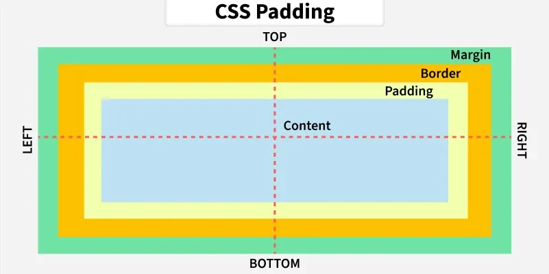

# Lecture 2: HTML and CSS #

<u>Hypertext</u>
*Ted Nelson and Nevadvar?? Bush*
\- Linking structure succeeds a (strict) tree structure
\- clicking on words to link to other pages
\- HyperText Markup Language

<u>Document Object Model (DOM)</u>
\- parses html
\- compare to SAX


```markdown-tree
document object model
	html
		head
			title
			script
		body
			div
				p
				img
			div
				p
				span
```

## CSS Demo: ##

```html
<!DOCTYPE html>
<html lang="en">
    <head>
        <meta charset="UTF-8">
        <title>CSS Demo from Class</title>
    </head>
    <body>
        <p style="background-color: #00FFFF; margin: 5; border: 1px solid #000000;">top paragraph</p>
        <div style="background-color: #FFFF00;">bottom paragraph
            </div>
        <div style="background-color: #00FF00;">bottom paragraph
            text <span></span> more text
        </div>
    </body>
</html>
```



<u>Stylesheet</u>
\- tag: no special formatting
\- class="classname": .classname
\- id="idtag": #idtag